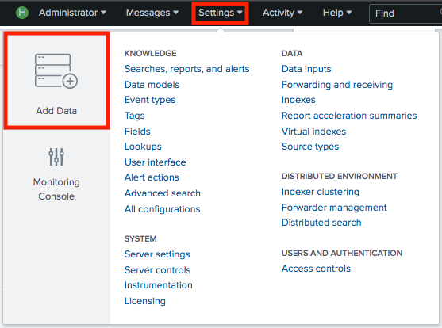
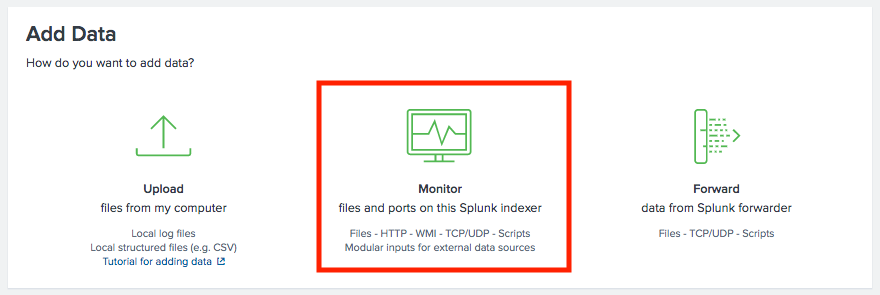
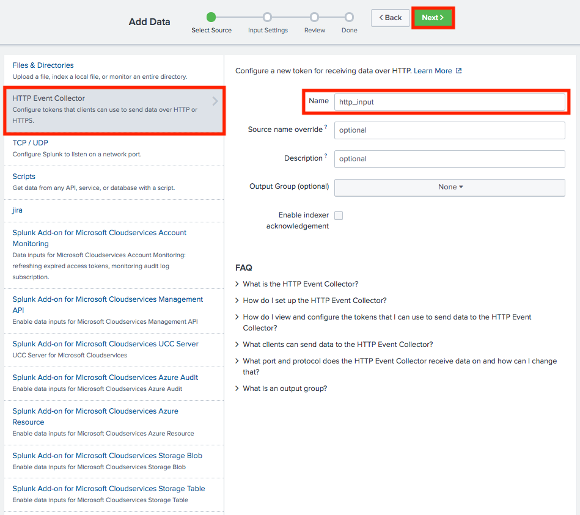

<link href="style.css" rel="stylesheet"></link>

# How to Index HTTP events in Splunk

## Configure the Splunk instance to index events

Select 'Settings' > 'Add Data'

Select 'Monitor'

Select 'HTTP Event Collector' > Add a Source Name > Select 'Next'

Select 'Create a new index', Add a index name and select 'Save'
Add the new index to 'Allowed Indexes' 

