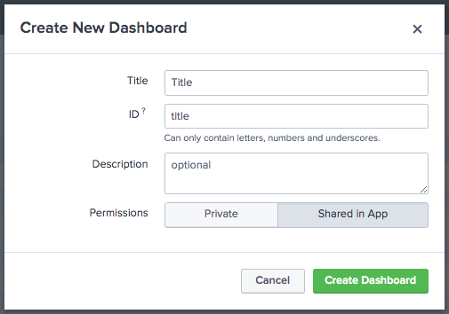

# How to create a Splunk HTML dashboard

## Create a HTML dashboard

In splunk select 'Apps' > 'Search & Reporting'

Select 'Dashboards' > 'Create New Dashboard'

Add a title and set permissions to 'Shared in App'

Select 'Create Dashboard'



Select 'Cancel' > '...' > 'Convert to HTML'

Select 'Replace Current' > 'Convert Dashboard' > 'Edit HTML'

Copy the contents of template.html into the dashboard body

Note the links to custom.css, custom.js and splunk.js in the HTML header

## Add the css and js files

Access the backend of Splunk and navigate to 

```$SPLUNK_HOME$\etc\apps\search\appserver\static\```

Copy the html_template directory from this Repo here

Note html_template contains custom.css, custom.js and splunk.js

splunk.js contains the JS used for loading the dashboards and running the table search

custom.css and custom.js are blank but can be used to add scripting and styling to the dashboard


