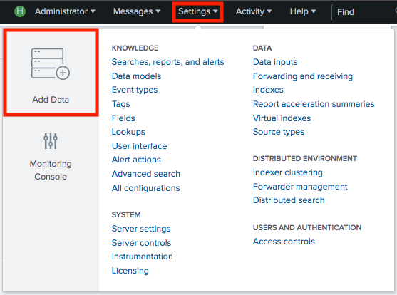
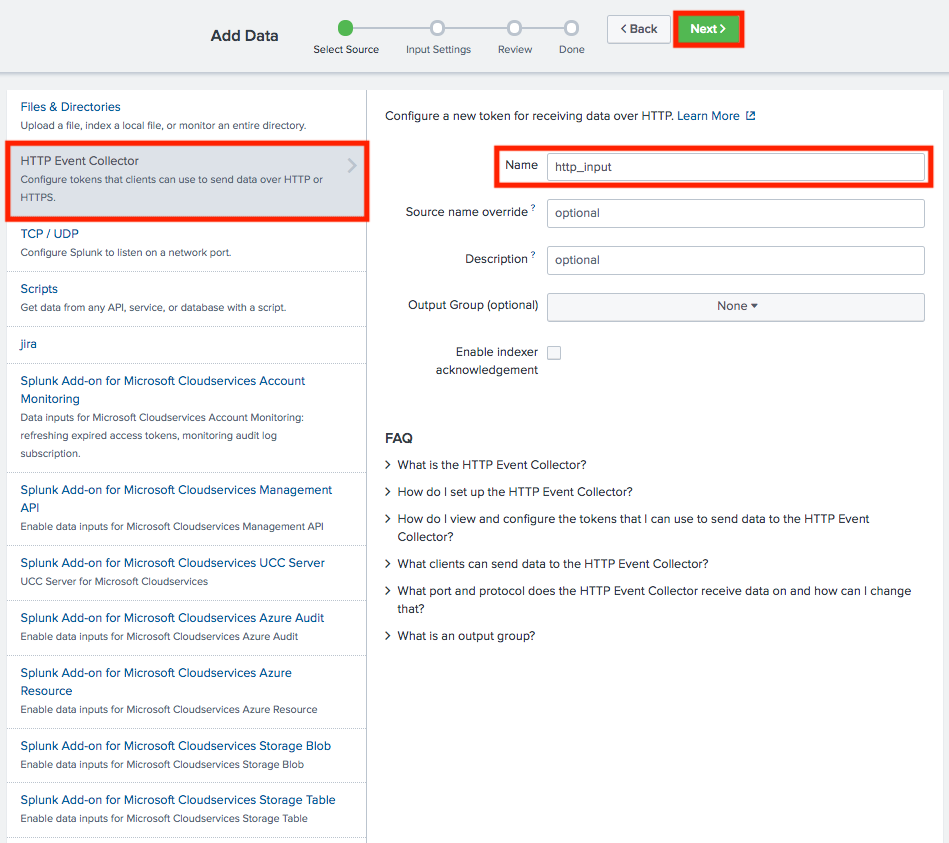
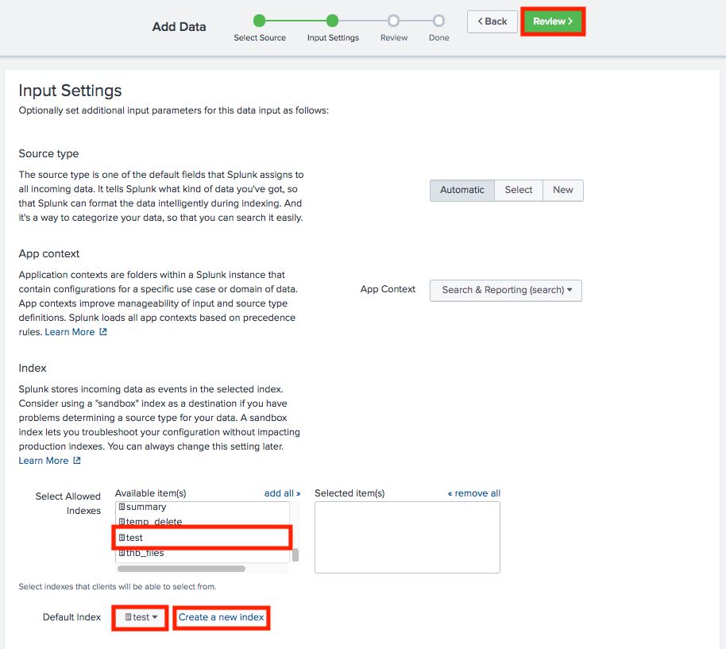
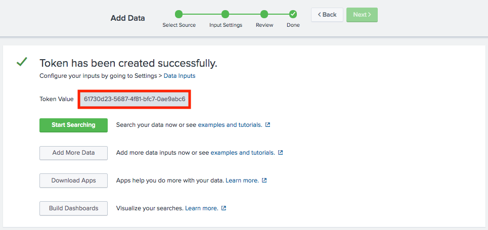
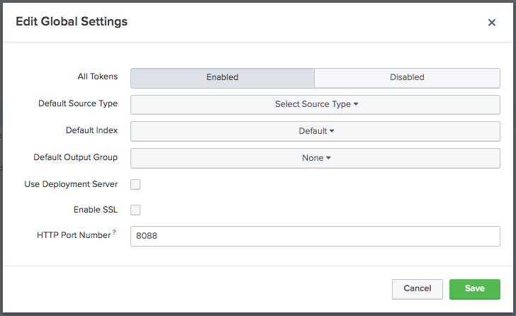

# How to Index HTTP events in Splunk


## Configure the Splunk instance to index events

Select 'Settings' > 'Add Data'




Select 'Monitor'


Select 'HTTP Event Collector' > Add a Source Name > Select 'Next'



Select 'Create a new index'

Add a index name and set size to 10MB and select 'Save'

Add the new index to 'Allowed Indexes' and select it from the dropdown

Select 'Review' then 'Done'



Copy the 'Token Value'




## Configure the Splunk index settings

Select 'Settings' > 'Data inputs' > 'HTTP Event Collector' > 'Global Settings'

Enable all tokens

Uncheck SSL

Make sure HTTP port number is 8088




## Curl event to Splunk

Curl from terminal with the format
```curl -k $URI$:$PORT$/services/collector -H 'Authorization: Splunk $TOKEN$' -d '{"event": {$EVENT$} }'```

e.g.
```curl -k http://localhost:8088/services/collector -H 'Authorization: Splunk 9a78a566-e388-46be-9811-ceed0a2904e6' -d '{"event": {"String Test" : "This is from a terminal curl"} }'```

Search the Splunk for the event

## Post events from python

Prerequisite: Python installed

Install requests
```pip install requests```

Create a Python script
```
import requests

token = '9a78a566-e388-46be-9811-ceed0a2904e6'

port = '8088'

uri = 'http://localhost:' + port + '/services/collector'

header = {'Authorization': 'Splunk ' + token} 

payload = '{"event": {"String Test" : "This is from a python script"} }'

print(requests.post(uri, data=payload, headers=header).text)
```
Run the script and search the Splunk index for events


